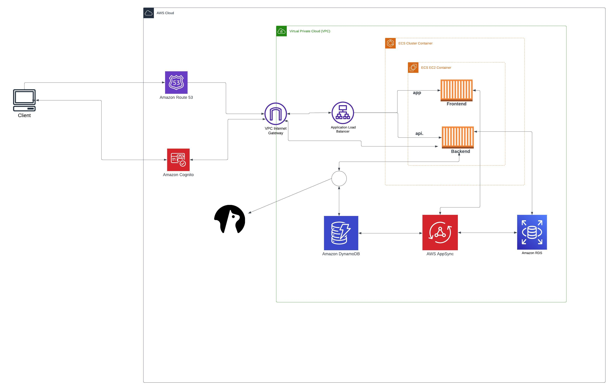

# Pre-requisite technologies

We are required to have the following technologies set up, as they will be needed in the course of the bootcamp. These  includes:

- Create a Github account. We will create our own repo from Andrew's repository, using template, with the right formatting of the repo and must be public.
- Download a gitpod extension and then create a gitpod account. This way, the gitpod tab will appear on our github.
- Create github codespace
- Create an AWS free tier account, as we will be utilizing the free tier benefit to spin up resources as we progress in the bootcamp.
- Create a Lucidchat account. With this account, we can create an architectural design of the application we want to create. This will enable us explain our work to the   stakeholders.
- Create Honeycomb.io account.
- Create Rollbar account. This will enable us to capture application crashes and uncaught errors. 
- 
# Week 0 — Billing and Architecture
This week (week 0), we will be looking at billing, architecture and security.
Billing in aws varies across regions, so we will keep this mind as we choose a region to provision our resources. As advised by the instructor, we will try to stay within the free tier limit of our account (newly created accounts have free tier benefit for 12 months)

# Billing Alerts

There are 2 ways to set the billing alerts.

- Using Budget. This is simplest way to monitor your AWS spend and be alerted when you exceed or are forecasted to exceed your desired spending limit.
- Using Cloudwatch Alarm. In this case, you need to create an alarm . You can create up to 10 free cloudwatch alarms

# Free Tier
This section will show all the usage of your free tier. It will show all the services that are free for the next 12 months (starts counting from the registration date) and their usage and forecast. After 12 months, they are still some services that are always free. And also there is some service that is "Trial" which means that is available for a short period such as 30 days.

# Tags
Tags (are Key/Value pair) are useful when you want to know how your cost is allocated. For example, if your want to identify all the services you used under the tag environment: dev (for example).

# Cost Explorer
Cost explorer is a service which visualises, understands and manages your AWS costs usage over time. You can view data for up to the last 12 months, forecast how much you're likely to spend for the next 12 months, and get recommendations for what Reserved Instances to purchase. You can use Cost Explorer to identify areas that need further inquiry and see trends that you can use to understand your costs.

# Report
The section report allows for generating reports. there are some reports already created by AWS that you can use

Credit
This is the section where you submit the credit that you obtained during an event (for example after submitting a feedback questionnaire). And also it shows when the expiration date.

# AWS Calculator
This is a tool where you want to estimate the cost of one or more services. Useful when someone asks you to give an estimated cost of the service you are going to use. It enables you to have an estimate of the cost of the AWS services you intend to use.

## ARCHITECTURAL DIAGRAM

I will display the architectural diagram below, but before that, I will lists the requirements of the architecture

# Requirements
- Application using micro services
- The frontend is in JS and the backend is in Python
- Using api to communicate
- Authentication using Cognito
- Use as much as possible the aws free tier
- Momento as a third party caching system

Kindly click on the url below to find the architectural diagram
(https://lucid.app/lucidchart/7c696a51-bc90-46ee-8439-4d69a6efa04a/edit?invitationId=inv_2c3aba1c-4acf-4740-a43e-1f1a45518685&page=0_0#)

